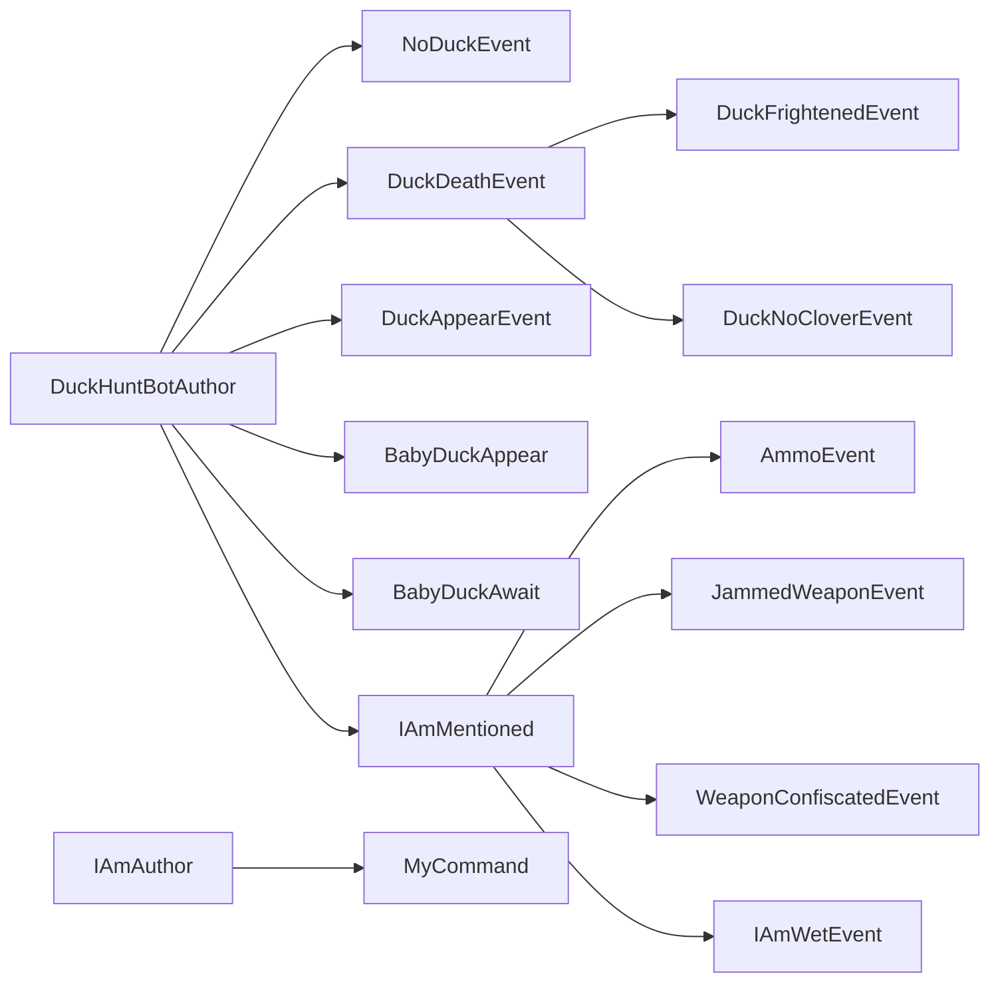
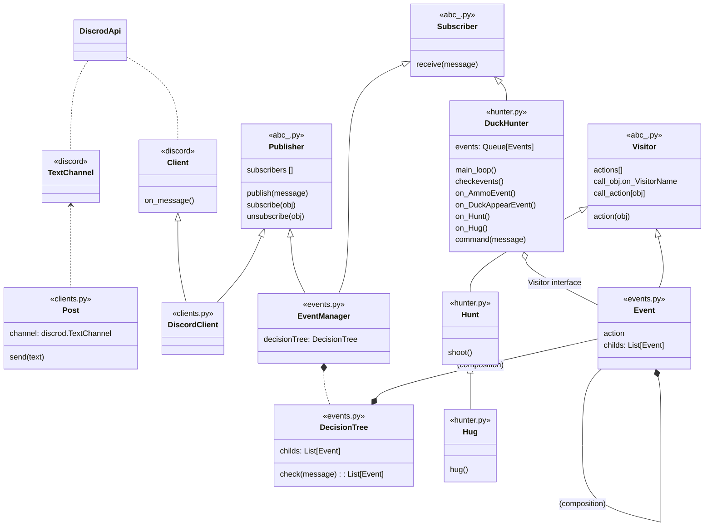

## Introduction
[HTML PREVIEW of this page](https://fenixsign.github.io/DuckHunterBot/)  
I use this repository as one of my portfolio. However, you can use it as you want.

[Issue for comments and reviews](https://github.com/fenixsign/DuckHunterBot/issues/1)

This is a repository of fun project for Discord Bot. Bot is written with asyncio python library. For connect it use discord client and api. Main aim of this bot is to play with [DuckHuntBot](https://github.com/DuckHunt-discord/DHV3) on Discord chat.

Advantages of this project:

- good structure and architecture

- asyncio 
- Events tree
- Events config
- asyncio pytests
- Hunter Hunt is Visitor too

#### If you are interesting and review code

Please, leave a review on issuies. I need your "+", "nice", "good", "this line can be more better...". If you have words to tell me, i want to know about it.

#### Content

1. Part 1. How it work
2. Part 2. How it was built
   1. Main parts of code
   2. Architecture principles
   3. Some diagrams

## Part 1. How it work

On some discord channel there appear message as '-,*,.-'`'°-,*,.-''`  < COUAAC', in random time. Gamers react on messages by commands such as 'dh!shoot' and another. More rules you can find on [source](https://docs.duckhunt.me/players-guide/players-quickstart). 

HunterBot hunt on this ducks.

He read messages and react on next events with next [DecisionTree](resources/DECISION_TREE.yaml):



Bot can :
- shoot
- check, if duck flowed away or killed by another gamers
- reload weapon and control his ammo
- hug baby duck
- buy magazines and bullets
- buy weapon, if it was confiscated
- buy clover, if it isn't equipped

Need to develop:

- control find items


## Part 2. How it built. Features of code.

### MainParts
```python
.
├── abc_.py	     # abc classes Publisher, Visitor, Subscriber
├── checkers.py  # body of checkers for Event config
├── clients.py   # client, which interact with DiscordApi: DiscrodClient, Post
├── config.py    # main constants for Bot, import secrets keys from secret.py
├── secret.py    # secrets keys for config
├── events.py    # classes works with events: Event, DecisionTree, EventManager
├── resources    
│   ├── DECISION_TREE.yaml # config, body of DecisionTree
│   └── EVENTS.yaml        # config, bodies for all Events with tests for its
├── funcsource   # my lib with popular functions which needs in each project
│   ├── __init__.py
│   └── traceback
├── docs
│   ├── DiscordApi.md
│   ├── EventDiagramm.md
│   ├── Events.md
│   ├── History.md
│   ├── Main.md
│   └── TODO.md
└── test
    ├── __init__.py
    ├── list_client_channels.py   # get list of channels of user
    ├── channel_history.py        # get channel message history
    ├── channel_listener.py       # resend messages from DiscordClient to terminal
    ├── EventManager_listener.py  # resend events from EventManager to terminal
    ├── testPost.py               # Post test - test sending messages to channel
    ├── primitives.py
    ├── resources                 # container for test samples
    │   ├── backup_messages_1000.pkl
    │   ├── channels.yaml
    │   ├── df_messages_1000.pkl
    │   ├── duck_messages_1000.pkl
    │   └── messages_1000.pkl
    ├── testDecisionArchitecture.py # test first idea of architercture of DecisionTree
    ├── test_events.py            # tests for Event class
    ├── test_hunter.py            # tests for Hunter class
    └── test_test_asyncio.py
```
### Dataflow

~~~mermaid
stateDiagram
    DiscordApi --> DiscordClient: message
    EventManager --> DiscordClient : (subscribe)
    DiscordClient --> EventManager: message
    state EventManager {
    [*] --> IfChannel
    IfChannel --> DecisionTree
    DecisionTree --> events_List
    events_List --> [*]
    }
    EventManager --> DuckHunter: ([events], message)
    DuckHunter --> EventManager : (subscribe)
    state DuckHunter {
    [*] --> EventsQueue
    EventsQueue --> on_EventNameMethod
    }
	DuckHunter --> Post : message
	state Post {
	[*] --> Queue
	Queue --> wait_delay
	wait_delay --> next_message
	next_message --> [*]
	}
	Post --> DiscordClient: send message
	DiscordClient --> DiscordApi: send message
~~~

### ClassDiagramm



### Events

Event object decide two tasks:

- build DecisionTree object to analyze message content (pattern Composite was used for it, see getchilds Event method)
- keep information, how another objects react on this Event (there was used Visitor pattern)
- simple creation and add new Events ([Events.yaml](resources/EVENTS.yaml))

Example Event config:

```yaml
DuckAppearEvent:
  level: INFO # similar to logging level
  checker:
    - regex # which funcion call on message content and args for her
    - <:official_Duck_01_reversed:439576463436546050>|try to hug the duck.?
  tests: # some simple tests for checker function to avoid misspells in checker
    true: 'sss <:official_Duck_01_reversed:439576463436546050> sss'
    false: ''
```

Each Event knowns his childs, and send them the message If self.checker(message) == True.

So on, there will be returned list of events from tree, which react on message

##### Interaction with Hunter:

When hunter receive the Event, He call Event.action from self.  Further, the Event get Hunter method associated with this Event, as in Visitor pattern. Each Event have their name and appropriate Hunter method. For example: DuckAppearEvent and Hunter.on_DuckAppearEvent().

##### DecisionTree

DecisionTree built from [DECISION_TREE.yaml](resources/DECISION_TREE.yaml) config with Event.get_childs() method


