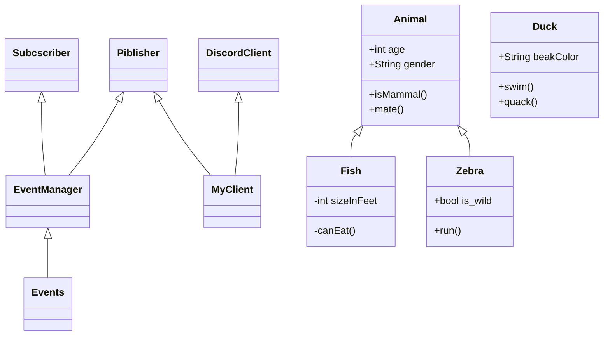

TODO:
    DECISION_TREE_DICT and event_checkers
    TESTS for classes/event_checkers
    + Сделать обычной обертку логгера, а не асинхронной
    
    Проблема с перезарядкой:
        1) бот не обрабатывает события в перерыве между отправкой сообщений
        2) бот не может отменить сообщение о выстреле в очереди сообщений
    
        
    Нужно стрелять сразу после получения информации о выстреле, а не чз 5 секунд
    
    Logger: formatter for pandas dataframe

Тесты:
    Тестирование регексов каждого события:
        По отдельности регекс каждого события
        Чз message обьекты для DecisionTree/EventManager
        
    Нужен датасет с размеченными сообщениями для тестирования
        Выгрузить историю сообщений, разметить и сразу собрать дерево решений

диаграмма тестирования

1. Убивать утку чз 500 секунд
    + Мониторить убийство утки другим игроком
    + Мониторить убийство собой
    + Мониторить супер утку
    + Мониторить промахи
    + Мониторить количество патронов и магазинов
        - перезаряжаться, если есть магазины
        - покупать при нехватке патроны и магазины
        - обновлять на основе ответа от бота
    + Учитывать дебаффы
        - конфискацию оружия
    
2. Опционально
    + Учитывать баффы на оружии
    + Качаться с помощью dhbuy 20 - и развлекать пассажиров))

История разработки:
    Три дня на разработку архитектуры
        Диаграмма архитектуры
    Три дня на сборку кода
    Тестирование:
        Hottests:
            DiscordClient/Listener
            EventManger/TEST_AUTHOR_DECISION_TREE_DICT
            

    

linecache.getlines
traceback.extract_tb(tb, limit=None)
traceback.extract_stack(f=None, limit=None)

Особенности sourcefunc.
    Timer
    форматтер ошибок
    перехватчики ошибок и их логгирование
   
Какие трудности возникли и какие пришлось решить:

Особенности проекта:
    Логгирование ошибок из asyncio:
        1) Разобрана traceback
        Блокирующий логгер:
            2) обертка для логгера, чтобы запускать его в стороннем потоке
    Нужны сообщения в сыром виде для тестов:
        3) используются внутренний апи библиотеки (get_raw_messages)
    
    Специальная структура событий:
        словарь с регексами и тут же лежат тесты для регексов
        происходит тестирование во время импорта модуля
    
class WrapperClient:
    @staticmethod
    def store_user(data):
        return discord.User(state=WrapperClient, data=data)

discord.Message(state=WrapperClient, channel='WrapperChannel', data=d[0])         