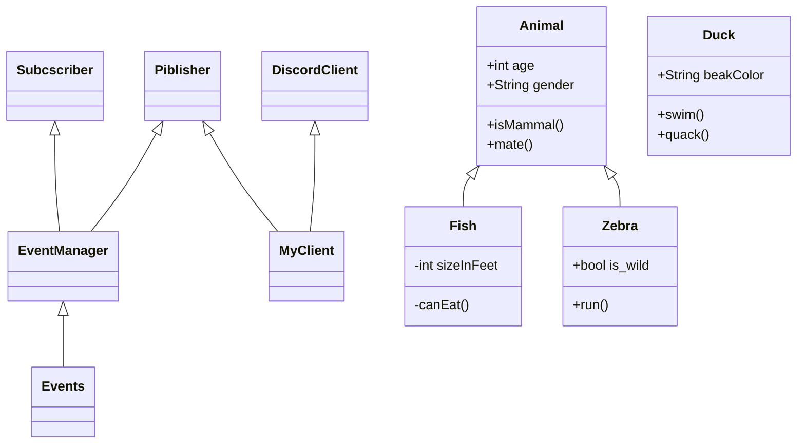

1. Убивать утку чз 500 секунд
    + Мониторить убийство утки другим игроком
    + Мониторить убийство собой
    + Мониторить супер утку
    + Мониторить промахи
    + Мониторить количество патронов и магазинов
        - перезаряжаться, если есть магазины
        - покупать при нехватке патроны и магазины
        - обновлять на основе ответа от бота
    + Учитывать дебаффы
        - конфискацию оружия
    
2. Опционально
    + Учитывать баффы на оружии
    + Качаться с помощью dhbuy 20 - и развлекать пассажиров))
    
