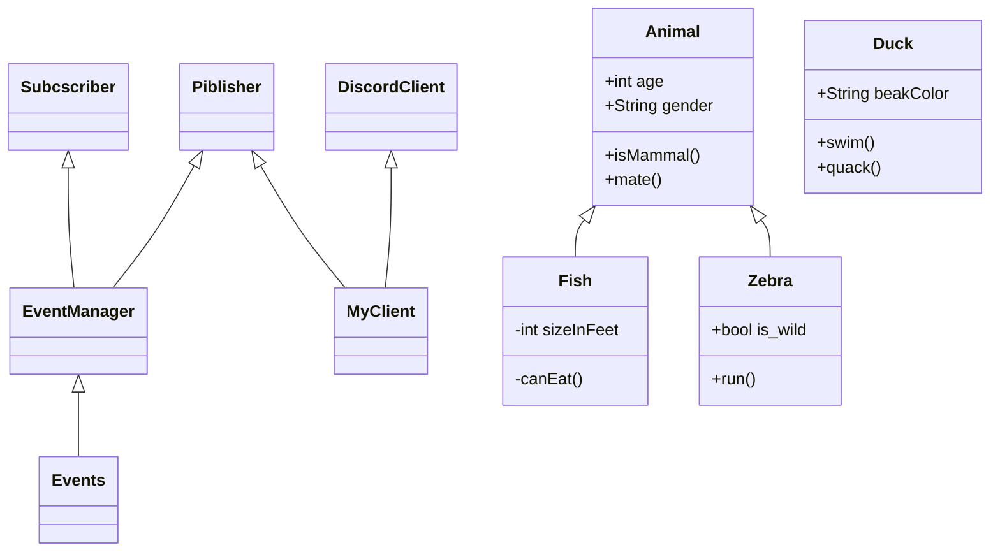

TODO:
    DECISION_TREE_DICT and event_checkers
    TESTS for classes/event_checkers
    + Сделать обычной обертку логгера, а не асинхронной
    
    Проблема с перезарядкой:
        1) бот не обрабатывает события в перерыве между отправкой сообщений
        2) бот не может отменить сообщение о выстреле в очереди сообщений
    
        
    Нужно стрелять сразу после получения информации о выстреле, а не чз 5 секунд
    
    Logger: formatter for pandas dataframe

Тесты:
    Тестирование регексов каждого события:
        По отдельности регекс каждого события
        Чз message обьекты для DecisionTree/EventManager
        
    Нужен датасет с размеченными сообщениями для тестирования
        Выгрузить историю сообщений, разметить и сразу собрать дерево решений
    
    # TODO test regex compile - verbose error compile exception : "re.error: nothing to repeat at position 110"
    # example: s =  r"|**FLAPP**)"
    
диаграмма тестирования

1. Убивать утку чз 500 секунд
    + Мониторить убийство утки другим игроком
    + Мониторить убийство собой
    + Мониторить супер утку
    + Мониторить промахи
    + Мониторить количество патронов и магазинов
        - перезаряжаться, если есть магазины
        - покупать при нехватке патроны и магазины
        - обновлять на основе ответа от бота
    + Учитывать дебаффы
        - конфискацию оружия
    
2. Опционально
    + Учитывать баффы на оружии
    + Качаться с помощью dhbuy 20 - и развлекать пассажиров))

История разработки:
    Три дня на разработку архитектуры
        Диаграмма архитектуры
    Три дня на сборку кода
    Тестирование:
        Hottests:
            DiscordClient/Listener
            EventManger/TEST_AUTHOR_DECISION_TREE_DICT
            

    


linecache.getlines
traceback.extract_tb(tb, limit=None)
traceback.extract_stack(f=None, limit=None)

Особенности sourcefunc.
    Timer
    форматтер ошибок
    перехватчики ошибок и их логгирование
   
Какие трудности возникли и какие пришлось решить:

Особенности проекта:
    Логгирование ошибок из asyncio:
        1) Разобрана traceback
        Блокирующий логгер:
            2) обертка для логгера, чтобы запускать его в стороннем потоке
    Нужны сообщения в сыром виде для тестов:
        3) используются внутренний апи библиотеки (get_raw_messages)
    
    Специальная структура событий:
        словарь с регексами и тут же лежат тесты для регексов
        происходит тестирование во время импорта модуля
    
Тесты для IAmMentioned & DuckHuntBotAuthor & MyMessage
```
{'id': '776462372156080138',
 'type': 0,
 'content': '<@771698164461207602> > :x: A required argument is missing.',
 'channel_id': '773492762384531497',
 'author': {'id': '187636089073172481',
  'username': 'DuckHunt',
  'avatar': '96bac38fcb632b7799ad33ab45ca592e',
  'discriminator': '0550',
  'public_flags': 65536,
  'bot': True},
 'attachments': [],
 'embeds': [],
 'mentions': [{'id': '771698164461207602',
   'username': 'an_fenix',
   'avatar': '1366a8c1f97ecc1c8424ddecb16e7939',
   'discriminator': '2270',
   'public_flags': 0}],
 'mention_roles': [],
 'pinned': False,
 'mention_everyone': False,
 'tts': False,
 'timestamp': '2020-11-12T15:04:15.495000+00:00',
 'edited_timestamp': None,
 'flags': 0}

{'id': '776473123225993248',
 'type': 0,
 'content': '\\\\_O<',
 'channel_id': '773492762384531497',
 'author': {'id': '771698164461207602',
  'username': 'an_fenix',
  'avatar': '1366a8c1f97ecc1c8424ddecb16e7939',
  'discriminator': '2270',
  'public_flags': 0},
 'attachments': [],
 'embeds': [],
 'mentions': [],
 'mention_roles': [],
 'pinned': False,
 'mention_everyone': False,
 'tts': False,
 'timestamp': '2020-11-12T15:46:58.750000+00:00',
 'edited_timestamp': None,
 'flags': 0}
 
 ```

         