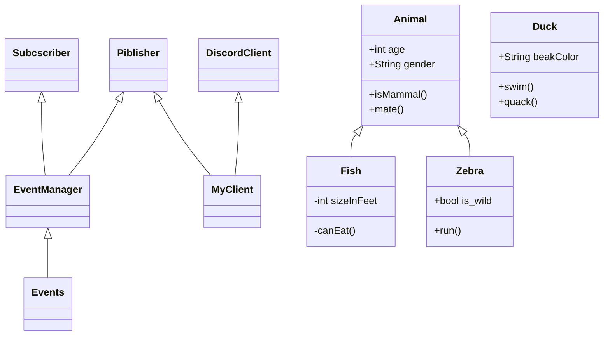

TODO:
    DECISION_TREE_DICT and event_checkers
    TESTS for classes/event_checkers

    Logger: formatter for pandas dataframe
    
    Проблема с перезарядкой:
        1) бот не обрабатывает события в перерыве между отправкой сообщений
        2) бот не может отменить сообщение о выстреле в очереди сообщений 
Ideas:

Тесты:
    Нужен датасет с размеченными сообщениями для тестирования
        Выгрузить историю сообщений, разметить и сразу собрать дерево решений

диаграмма тестирования

1. Убивать утку чз 500 секунд
    + Мониторить убийство утки другим игроком
    + Мониторить убийство собой
    + Мониторить супер утку
    + Мониторить промахи
    + Мониторить количество патронов и магазинов
        - перезаряжаться, если есть магазины
        - покупать при нехватке патроны и магазины
        - обновлять на основе ответа от бота
    + Учитывать дебаффы
        - конфискацию оружия
    
2. Опционально
    + Учитывать баффы на оружии
    + Качаться с помощью dhbuy 20 - и развлекать пассажиров))

История разработки:
    Три дня на разработку архитектуры
        Диаграмма архитектуры
    Три дня на сборку кода
    Тестирование:
        Hottests:
            DiscordClient/Listener
            EventManger/TEST_AUTHOR_DECISION_TREE_DICT
            

    
